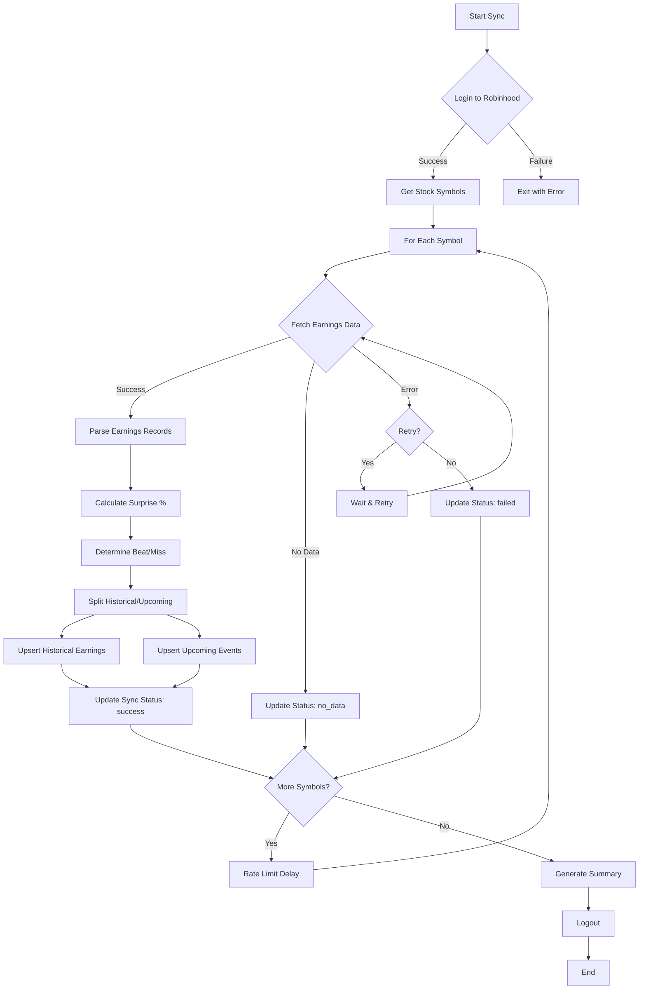

# Earnings Sync Service - Complete Documentation

## Table of Contents
1. [Overview](#overview)
2. [Architecture](#architecture)
3. [Database Schema](#database-schema)
4. [Service API](#service-api)
5. [CLI Usage](#cli-usage)
6. [Integration Examples](#integration-examples)
7. [Error Handling](#error-handling)
8. [Performance Optimization](#performance-optimization)
9. [Troubleshooting](#troubleshooting)

---

## Overview

The Earnings Sync Service is a robust data synchronization system that fetches earnings data from Robinhood API and stores it in a PostgreSQL database. It supports historical earnings tracking, upcoming earnings calendar, beat/miss pattern analysis, and comprehensive error handling.

### Key Features

- **Dual Storage**: Separate tables for historical earnings and upcoming events
- **Surprise Calculation**: Automatic calculation of EPS surprise percentages
- **Beat/Miss Tracking**: Classification and historical pattern analysis
- **Retry Logic**: Configurable retry mechanism for API failures
- **Rate Limiting**: Built-in delays to avoid API throttling
- **Progress Tracking**: Real-time sync status monitoring
- **Batch Processing**: Efficient database upserts
- **CLI Tool**: Command-line interface for manual operations

### Data Sources

- **Primary**: Robinhood API (`robin_stocks.robinhood.get_earnings()`)
- **Returns**: Up to 8 quarters of historical earnings per symbol
- **Updates**: Can be run daily/weekly for continuous sync

---

## Architecture

### System Architecture

```
┌─────────────────────────────────────────────────────────────┐
│                    EARNINGS SYNC SERVICE                     │
└─────────────────────────────────────────────────────────────┘
                              │
                              │
         ┌────────────────────┼────────────────────┐
         │                    │                    │
         ▼                    ▼                    ▼
┌─────────────────┐  ┌─────────────────┐  ┌──────────────┐
│  Robinhood API  │  │   PostgreSQL    │  │  CLI Tool    │
│                 │  │    Database     │  │              │
│ get_earnings()  │  │                 │  │ sync_earnings│
└─────────────────┘  └─────────────────┘  └──────────────┘
         │                    │
         │                    │
         └────────────┬───────┘
                      │
              ┌───────▼────────┐
              │  Data Pipeline  │
              │                 │
              │ 1. Fetch        │
              │ 2. Parse        │
              │ 3. Calculate    │
              │ 4. Store        │
              │ 5. Track        │
              └─────────────────┘
```

### Service Flow Diagram



### Database Entity Relationship

```
┌─────────────────────────┐
│   earnings_history      │
│─────────────────────────│
│ id (PK)                 │
│ symbol                  │
│ report_date             │
│ fiscal_year             │
│ fiscal_quarter          │
│ eps_actual              │
│ eps_estimate            │
│ eps_surprise_percent    │
│ beat_miss               │
│ ...                     │
└─────────────────────────┘
           │
           │ (1:N)
           ▼
┌─────────────────────────┐      ┌──────────────────────────┐
│   earnings_events       │      │ earnings_sync_status     │
│─────────────────────────│      │──────────────────────────│
│ id (PK)                 │      │ id (PK)                  │
│ symbol                  │◄─────│ symbol (UNIQUE)          │
│ earnings_date           │      │ last_sync_at             │
│ earnings_time           │      │ last_sync_status         │
│ eps_estimate            │      │ historical_quarters_found│
│ eps_actual              │      │ upcoming_events_found    │
│ pre_earnings_iv         │      │ total_syncs              │
│ post_earnings_iv        │      │ failed_syncs             │
│ has_occurred            │      │ ...                      │
│ ...                     │      └──────────────────────────┘
└─────────────────────────┘
```

---

## Database Schema

### Tables

#### 1. earnings_history
Stores all historical earnings reports (past quarters)

**Key Columns:**
- `symbol`: Stock ticker
- `report_date`: Date earnings were reported
- `eps_actual`: Actual EPS reported
- `eps_estimate`: Analyst consensus estimate
- `eps_surprise_percent`: ((actual - estimate) / |estimate|) * 100
- `beat_miss`: Classification (beat/miss/meet/unknown)
- `fiscal_year`, `fiscal_quarter`: Fiscal period
- `raw_data`: Complete Robinhood API response (JSONB)

**Indexes:**
- `idx_earnings_history_symbol`: Fast symbol lookups
- `idx_earnings_history_date`: Time-based queries
- `idx_earnings_history_symbol_date`: Combined lookups

#### 2. earnings_events
Stores upcoming earnings announcements

**Key Columns:**
- `symbol`: Stock ticker
- `earnings_date`: Scheduled earnings date
- `earnings_time`: BMO (before market open) / AMC (after market close)
- `eps_estimate`: Analyst consensus
- `pre_earnings_iv`, `post_earnings_iv`: Implied volatility tracking
- `has_occurred`: Flag to mark past events
- `is_confirmed`: Verification flag

**Indexes:**
- `idx_earnings_events_upcoming`: Fast upcoming earnings queries
- `idx_earnings_events_symbol_date`: Combined lookups

#### 3. earnings_sync_status
Tracks sync operations per symbol

**Key Columns:**
- `symbol`: Stock ticker (UNIQUE)
- `last_sync_at`: Last successful sync timestamp
- `last_sync_status`: success/failed/partial/no_data
- `historical_quarters_found`: Count of historical records
- `total_syncs`, `failed_syncs`: Statistics

**Purpose:** Monitoring, debugging, scheduling next syncs

#### 4. earnings_alerts
User-configurable alerts for earnings events

**Key Columns:**
- `user_id`: User reference
- `symbol`: Stock ticker
- `alert_type`: Type of alert
- `is_active`: Enable/disable alerts

### Views

#### v_upcoming_earnings
Pre-joined view of upcoming earnings with historical beat rates

```sql
SELECT * FROM v_upcoming_earnings
WHERE earnings_date <= CURRENT_DATE + INTERVAL '7 days';
```

#### v_earnings_beat_stats
Statistical analysis of earnings performance by symbol

```sql
SELECT * FROM v_earnings_beat_stats
WHERE beat_rate_pct >= 75  -- Strong beaters
ORDER BY total_reports DESC;
```

#### v_high_conviction_earnings
Earnings with clear historical patterns (75%+ beat or miss rate)

```sql
SELECT * FROM v_high_conviction_earnings;
```

### Functions

#### calculate_beat_rate(symbol, lookback_quarters)
Calculates percentage of beats in recent quarters

```sql
SELECT calculate_beat_rate('AAPL', 8);  -- Last 8 quarters
```

#### get_next_earnings_date(symbol)
Returns next scheduled earnings date

```sql
SELECT get_next_earnings_date('NVDA');
```

#### update_sync_status(...)
Updates sync tracking (used internally by service)

---

## Service API

### Class: EarningsSyncService

```python
from src.earnings_sync_service import EarningsSyncService

# Initialize service
service = EarningsSyncService(
    max_retries=3,           # API retry attempts
    retry_delay=5,           # Seconds between retries
    batch_size=50            # DB batch insert size
)
```

### Methods

#### 1. sync_all_stocks_earnings()

Syncs earnings for all stocks in database

```python
summary = service.sync_all_stocks_earnings(
    limit=None,              # Optional: limit number of stocks
    rate_limit_delay=1.0     # Delay between API calls (seconds)
)

# Returns:
# {
#     'status': 'completed',
#     'total_stocks': 999,
#     'successful': 950,
#     'failed': 10,
#     'no_data': 39,
#     'total_historical_records': 7600,
#     'total_upcoming_events': 150,
#     'success_rate': '95.1%'
# }
```

**Use Case:** Initial database population or full refresh

#### 2. sync_symbol_earnings()

Syncs earnings for a single symbol

```python
result = service.sync_symbol_earnings('AAPL')

# Returns:
# {
#     'symbol': 'AAPL',
#     'status': 'success',
#     'historical_count': 8,
#     'upcoming_count': 1,
#     'error': None
# }
```

**Use Case:** On-demand sync for specific stocks

#### 3. get_upcoming_earnings()

Retrieves upcoming earnings events

```python
events = service.get_upcoming_earnings(days_ahead=30)

# Returns list of dictionaries:
# [
#     {
#         'symbol': 'NVDA',
#         'earnings_date': datetime.date(2025, 11, 15),
#         'earnings_time': 'amc',
#         'eps_estimate': 0.75,
#         'historical_beat_rate_pct': 87.5,
#         'last_quarter_surprise_pct': 15.2
#     },
#     ...
# ]
```

**Use Case:** Building earnings calendar views

#### 4. get_historical_earnings()

Retrieves historical earnings for a symbol

```python
history = service.get_historical_earnings('TSLA', limit=8)

# Returns list of dictionaries:
# [
#     {
#         'symbol': 'TSLA',
#         'report_date': datetime.date(2025, 10, 18),
#         'fiscal_year': 2025,
#         'fiscal_quarter': 3,
#         'eps_actual': 0.72,
#         'eps_estimate': 0.68,
#         'eps_surprise_percent': 5.88,
#         'beat_miss': 'beat'
#     },
#     ...
# ]
```

**Use Case:** Historical performance analysis

#### 5. calculate_beat_rate()

Calculates earnings beat rate percentage

```python
beat_rate = service.calculate_beat_rate('AAPL', lookback_quarters=8)
# Returns: 75.0  (75% of last 8 quarters were beats)
```

**Use Case:** Pattern recognition, conviction scoring

---

## CLI Usage

### Installation

```bash
# Ensure dependencies are installed
pip install -r requirements.txt

# Make CLI executable (Linux/Mac)
chmod +x sync_earnings.py
```

### Command Reference

#### Sync All Stocks

```bash
# Full sync of all stocks in database
python sync_earnings.py --all

# Sync first 100 stocks (testing)
python sync_earnings.py --all --limit 100

# Sync with custom delay (avoid rate limiting)
python sync_earnings.py --all --delay 2.0
```

#### Sync Specific Symbols

```bash
# Single symbol
python sync_earnings.py --symbol AAPL

# Multiple symbols
python sync_earnings.py --symbols AAPL,NVDA,TSLA,META

# With verbose logging
python sync_earnings.py --symbol GOOGL --verbose
```

#### Query Operations

```bash
# Show upcoming earnings (next 7 days)
python sync_earnings.py --upcoming 7

# Show upcoming earnings (next 30 days)
python sync_earnings.py --upcoming 30

# Show earnings history for a symbol
python sync_earnings.py --history NVDA

# Show last 12 quarters instead of default 8
python sync_earnings.py --history AAPL --quarters 12

# Show beat rate
python sync_earnings.py --beat-rate TSLA

# Show sync statistics
python sync_earnings.py --stats
```

#### Combined Operations

```bash
# Sync and show details
python sync_earnings.py --symbol NVDA --history NVDA --beat-rate NVDA
```

### Output Examples

#### Upcoming Earnings Output

```
================================================================================
  UPCOMING EARNINGS (Next 7 Days)
================================================================================

2025-11-01 (Monday)
--------------------------------------------------------------------------------
Symbol     Time     EPS Est      Beat Rate    Last Q Surprise
---------  -------  -----------  -----------  --------------
AMD        AMC      $0.92        62.5%        +8.7%
MSFT       AMC      $2.98        75.0%        +5.2%

2025-11-02 (Tuesday)
--------------------------------------------------------------------------------
Symbol     Time     EPS Est      Beat Rate    Last Q Surprise
---------  -------  -----------  -----------  --------------
GOOGL      AMC      $1.85        87.5%        +12.3%
META       AMC      $5.23        75.0%        +18.5%

Total: 4 upcoming earnings
```

#### Earnings History Output

```
================================================================================
  EARNINGS HISTORY - NVDA (Last 8 Quarters)
================================================================================
Date         Quarter    Actual     Estimate   Surprise     Beat/Miss
-----------  ---------  ---------  ---------  -----------  ---------
2025-08-28   Q2 2026    $0.68      $0.64      +6.2%        BEAT
2025-05-22   Q1 2026    $6.12      $5.59      +9.5%        BEAT
2025-02-21   Q4 2025    $5.16      $4.59      +12.4%       BEAT
2024-11-20   Q3 2025    $4.02      $3.37      +19.3%       BEAT
2024-08-28   Q2 2025    $0.67      $0.64      +4.7%        BEAT
2024-05-22   Q1 2025    $6.04      $5.58      +8.2%        BEAT
2024-02-21   Q4 2024    $5.16      $4.60      +12.2%       BEAT
2023-11-21   Q3 2024    $4.02      $3.34      +20.4%       BEAT

Total: 8 quarters
```

---

## Integration Examples

### Example 1: Daily Sync Scheduler

```python
"""
Daily earnings sync script for cron/scheduler
Run at 6 AM daily to sync all stocks
"""

from src.earnings_sync_service import EarningsSyncService
import logging

logging.basicConfig(
    filename='/var/log/earnings_sync.log',
    level=logging.INFO,
    format='%(asctime)s - %(levelname)s - %(message)s'
)

def daily_sync():
    service = EarningsSyncService(
        max_retries=3,
        retry_delay=5,
        batch_size=100
    )

    # Full sync with rate limiting
    summary = service.sync_all_stocks_earnings(
        rate_limit_delay=1.5  # Conservative delay
    )

    # Log results
    logging.info(f"Daily sync completed: {summary}")

    # Alert if success rate < 90%
    success_rate = summary['successful'] / summary['total_stocks']
    if success_rate < 0.90:
        # Send alert (email, Slack, etc.)
        send_alert(f"Low sync success rate: {success_rate*100:.1f}%")

if __name__ == "__main__":
    daily_sync()
```

### Example 2: Earnings Calendar API Endpoint

```python
"""
Flask API endpoint for earnings calendar
"""

from flask import Flask, jsonify, request
from src.earnings_sync_service import EarningsSyncService

app = Flask(__name__)
service = EarningsSyncService()

@app.route('/api/earnings/upcoming', methods=['GET'])
def get_upcoming_earnings():
    """Get upcoming earnings events"""
    days = request.args.get('days', default=30, type=int)

    events = service.get_upcoming_earnings(days_ahead=days)

    # Convert dates to strings for JSON
    for event in events:
        if 'earnings_date' in event:
            event['earnings_date'] = str(event['earnings_date'])

    return jsonify({
        'success': True,
        'count': len(events),
        'events': events
    })

@app.route('/api/earnings/history/<symbol>', methods=['GET'])
def get_earnings_history(symbol):
    """Get earnings history for a symbol"""
    quarters = request.args.get('quarters', default=8, type=int)

    history = service.get_historical_earnings(symbol.upper(), limit=quarters)

    # Convert dates to strings
    for record in history:
        for key in ['report_date', 'synced_at', 'updated_at']:
            if key in record and record[key]:
                record[key] = str(record[key])

    return jsonify({
        'success': True,
        'symbol': symbol.upper(),
        'count': len(history),
        'history': history
    })

@app.route('/api/earnings/beat-rate/<symbol>', methods=['GET'])
def get_beat_rate(symbol):
    """Get earnings beat rate for a symbol"""
    quarters = request.args.get('quarters', default=8, type=int)

    beat_rate = service.calculate_beat_rate(symbol.upper(), lookback_quarters=quarters)

    return jsonify({
        'success': True,
        'symbol': symbol.upper(),
        'beat_rate': beat_rate,
        'lookback_quarters': quarters
    })

@app.route('/api/earnings/sync/<symbol>', methods=['POST'])
def sync_symbol(symbol):
    """Trigger sync for a specific symbol"""
    result = service.sync_symbol_earnings(symbol.upper())

    return jsonify({
        'success': result['status'] == 'success',
        'result': result
    })

if __name__ == '__main__':
    app.run(debug=True, port=5001)
```

### Example 3: High Conviction Earnings Scanner

```python
"""
Scan for high-conviction earnings opportunities
"""

from src.earnings_sync_service import EarningsSyncService
from datetime import date, timedelta

def find_high_conviction_plays():
    service = EarningsSyncService()

    # Get upcoming earnings in next 14 days
    upcoming = service.get_upcoming_earnings(days_ahead=14)

    high_conviction = []

    for event in upcoming:
        symbol = event['symbol']

        # Calculate beat rate
        beat_rate = service.calculate_beat_rate(symbol, lookback_quarters=8)

        # High conviction criteria
        if beat_rate >= 75:  # Strong beaters
            high_conviction.append({
                'symbol': symbol,
                'earnings_date': event['earnings_date'],
                'beat_rate': beat_rate,
                'eps_estimate': event.get('eps_estimate'),
                'signal': 'BULLISH - Consistent Beater'
            })
        elif beat_rate <= 25:  # Consistent missers
            high_conviction.append({
                'symbol': symbol,
                'earnings_date': event['earnings_date'],
                'beat_rate': beat_rate,
                'eps_estimate': event.get('eps_estimate'),
                'signal': 'BEARISH - Consistent Misser'
            })

    return high_conviction

# Usage
plays = find_high_conviction_plays()
for play in plays:
    print(f"{play['symbol']}: {play['signal']} (Beat Rate: {play['beat_rate']}%)")
```

### Example 4: Pre-Earnings IV Scanner

```python
"""
Monitor pre-earnings implied volatility
"""

from src.earnings_sync_service import EarningsSyncService
import psycopg2

def scan_high_iv_earnings(min_iv_threshold=0.50):
    service = EarningsSyncService()
    conn = service.get_db_connection()
    cur = conn.cursor()

    # Query earnings with high pre-earnings IV
    query = """
        SELECT
            symbol,
            earnings_date,
            earnings_time,
            eps_estimate,
            pre_earnings_iv,
            historical_beat_rate_pct
        FROM v_upcoming_earnings
        WHERE pre_earnings_iv >= %s
        AND earnings_date <= CURRENT_DATE + INTERVAL '7 days'
        ORDER BY pre_earnings_iv DESC
    """

    cur.execute(query, (min_iv_threshold,))
    results = cur.fetchall()

    cur.close()
    conn.close()

    return results

# Usage
high_iv_plays = scan_high_iv_earnings(min_iv_threshold=0.60)
for play in high_iv_plays:
    print(f"{play[0]}: IV={play[4]:.1%}, Beat Rate={play[5]}%")
```

---

## Error Handling

### Error Types

#### 1. RobinhoodAPIError
**Cause:** API connection issues, rate limiting, authentication failures

**Handling:**
- Automatic retry with exponential backoff
- Configurable max retries (default: 3)
- Logs detailed error messages

```python
# Service automatically retries
result = service.sync_symbol_earnings('AAPL')

if result['status'] == 'failed':
    print(f"Error: {result['error']}")
```

#### 2. EarningsDataError
**Cause:** Invalid data format, missing required fields

**Handling:**
- Skips invalid records
- Logs parsing errors
- Continues processing remaining data

#### 3. Database Connection Errors
**Cause:** PostgreSQL connection issues, permission errors

**Handling:**
- Immediate failure with clear error message
- Rollback transaction on error
- No partial data commits

### Retry Strategy

```python
def fetch_earnings_with_retry(symbol):
    for attempt in range(1, max_retries + 1):
        try:
            return rh.get_earnings(symbol)
        except Exception as e:
            if attempt < max_retries:
                time.sleep(retry_delay * attempt)  # Exponential backoff
            else:
                raise
```

### Logging Levels

- **DEBUG**: API request/response details
- **INFO**: Sync progress, successful operations
- **WARNING**: Retry attempts, parsing issues
- **ERROR**: Failed syncs, critical errors

---

## Performance Optimization

### Database Performance

#### 1. Batch Inserts
```python
# Bad: One at a time
for record in records:
    cur.execute("INSERT INTO ...", record)

# Good: Batch insert
execute_batch(cur, "INSERT INTO ...", records, page_size=50)
```

#### 2. Use Indexes
All critical columns are indexed:
- `symbol` columns for fast lookups
- `date` columns for range queries
- Combined indexes for common query patterns

#### 3. Materialized Views (Future)
```sql
CREATE MATERIALIZED VIEW mv_earnings_stats AS
SELECT * FROM v_earnings_beat_stats;

-- Refresh daily
REFRESH MATERIALIZED VIEW mv_earnings_stats;
```

### API Performance

#### 1. Rate Limiting
```python
# Avoid API throttling
service.sync_all_stocks_earnings(rate_limit_delay=1.5)
```

#### 2. Parallel Processing (Future Enhancement)
```python
# Process symbols in parallel (use with caution)
from concurrent.futures import ThreadPoolExecutor

with ThreadPoolExecutor(max_workers=5) as executor:
    futures = [executor.submit(service.sync_symbol_earnings, sym)
               for sym in symbols]
```

### Memory Optimization

#### 1. Streaming Results
```python
# For large datasets, use server-side cursors
cur = conn.cursor(name='fetch_large_dataset')
cur.execute("SELECT * FROM earnings_history")

for record in cur:  # Streaming, not loading all at once
    process(record)
```

---

## Troubleshooting

### Common Issues

#### 1. No Data Returned for Symbol

**Symptom:**
```
sync_symbol_earnings('XYZ') returns status='no_data'
```

**Causes:**
- Symbol has no earnings data in Robinhood
- Recently IPO'd company
- Non-earnings reporting entity (ETF, fund, etc.)

**Solution:**
- Verify symbol is correct
- Check if symbol is optionable/earnings-reporting
- Review Robinhood web/app for data availability

#### 2. Robinhood Login Failures

**Symptom:**
```
Failed to login to Robinhood
```

**Causes:**
- Invalid credentials
- 2FA enabled (not supported)
- Account locked/restricted

**Solution:**
```bash
# Verify credentials in .env
cat .env | grep ROBINHOOD

# Test login manually
python -c "import robin_stocks.robinhood as rh; \
           rh.login('user', 'pass')"
```

#### 3. Database Connection Errors

**Symptom:**
```
psycopg2.OperationalError: could not connect to server
```

**Solution:**
```bash
# Check PostgreSQL is running
psql -U postgres -d magnus -c "SELECT 1"

# Verify connection parameters in .env
DB_HOST=localhost
DB_PORT=5432
DB_NAME=magnus
DB_USER=postgres
DB_PASSWORD=your_password
```

#### 4. Slow Sync Performance

**Symptom:**
Sync takes > 30 minutes for 1000 stocks

**Solutions:**
1. Increase rate limit delay (avoid throttling):
   ```python
   service.sync_all_stocks_earnings(rate_limit_delay=2.0)
   ```

2. Use batch processing:
   ```python
   service = EarningsSyncService(batch_size=100)
   ```

3. Run during off-peak hours

#### 5. Missing Historical Data

**Symptom:**
Symbol has < 8 quarters of data

**Causes:**
- Recently IPO'd
- Limited trading history
- Robinhood API limitations

**Expected Behavior:**
Service stores whatever data is available (may be < 8 quarters)

---

## Maintenance Tasks

### Daily Tasks
```bash
# Sync all stocks
python sync_earnings.py --all --delay 1.5

# Check sync statistics
python sync_earnings.py --stats
```

### Weekly Tasks
```bash
# Verify database integrity
psql -U postgres -d magnus -c "
    SELECT COUNT(*) as total_symbols,
           COUNT(DISTINCT symbol) as unique_symbols
    FROM earnings_history;
"

# Check for stale data
psql -U postgres -d magnus -c "
    SELECT symbol, last_sync_at
    FROM earnings_sync_status
    WHERE last_sync_at < NOW() - INTERVAL '7 days'
    ORDER BY last_sync_at;
"
```

### Monthly Tasks
```bash
# Archive old earnings events
psql -U postgres -d magnus -c "
    DELETE FROM earnings_events
    WHERE earnings_date < CURRENT_DATE - INTERVAL '6 months'
    AND has_occurred = TRUE;
"

# Vacuum and analyze
psql -U postgres -d magnus -c "
    VACUUM ANALYZE earnings_history;
    VACUUM ANALYZE earnings_events;
"
```

---

## Future Enhancements

### Planned Features

1. **Whisper Number Integration**
   - Scrape unofficial analyst estimates
   - Compare against official estimates

2. **Pre/Post Earnings Price Tracking**
   - Auto-capture stock prices before/after earnings
   - Calculate actual price moves

3. **Options IV Tracking**
   - Monitor IV crush post-earnings
   - Track historical IV patterns

4. **Earnings Call Transcripts**
   - Download and store call transcripts
   - Sentiment analysis on management commentary

5. **Alert System**
   - Email/SMS alerts for upcoming earnings
   - Notifications for unusual patterns

6. **API Rate Limit Detection**
   - Auto-adjust delays based on API responses
   - Exponential backoff on rate limit errors

7. **Incremental Sync**
   - Only sync symbols that need updates
   - Smart scheduling based on last sync time

---

## Support & Contact

For issues, questions, or contributions:

- **GitHub Issues**: (your-repo-url)
- **Documentation**: This file
- **Email**: (your-email)

---

**Last Updated:** 2025-10-28
**Version:** 1.0.0
**License:** MIT
