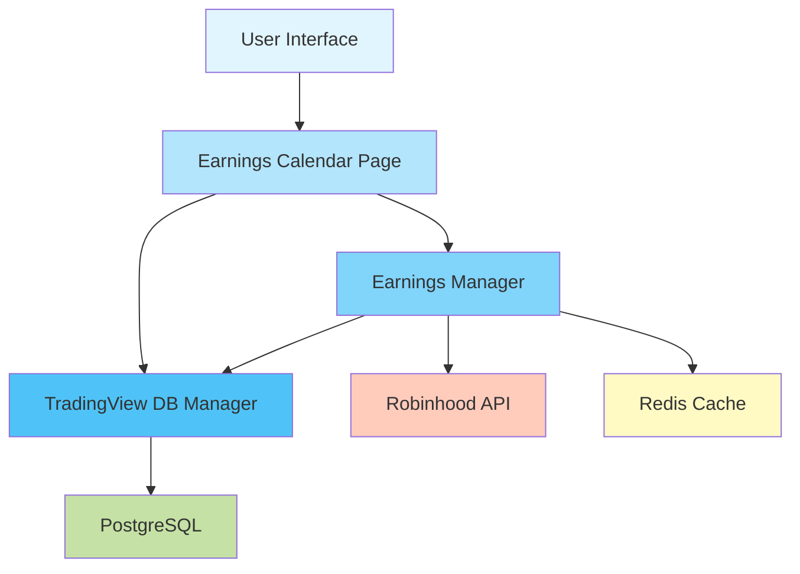
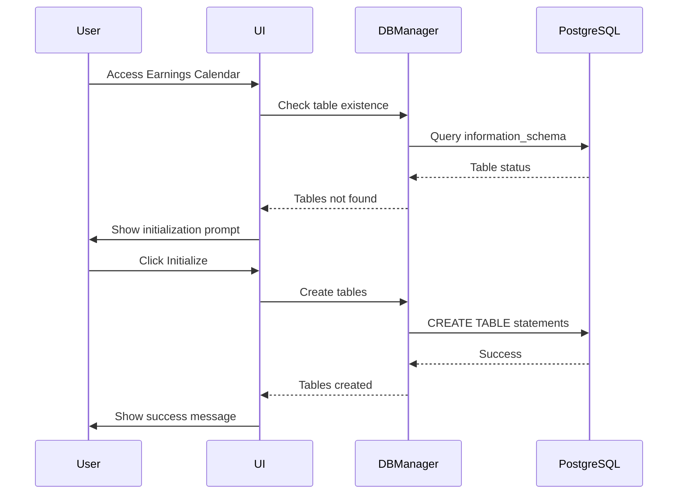
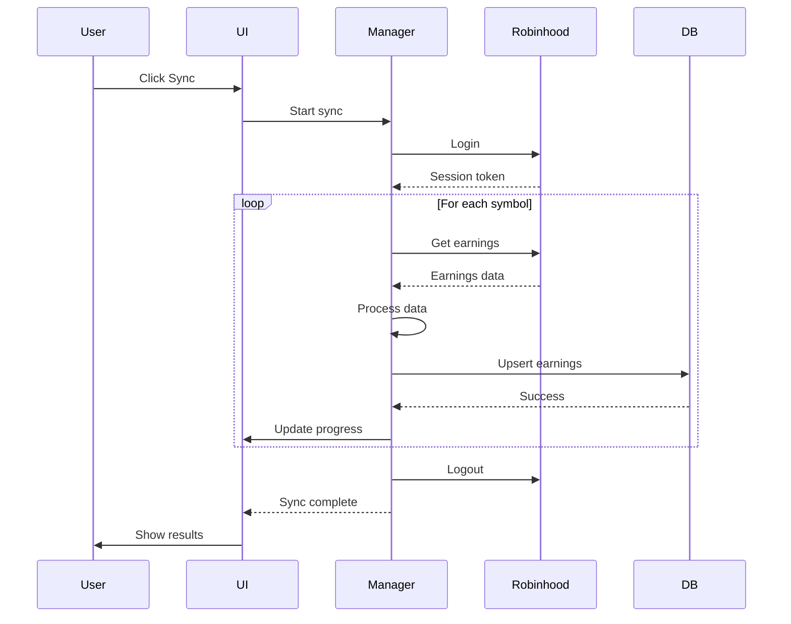
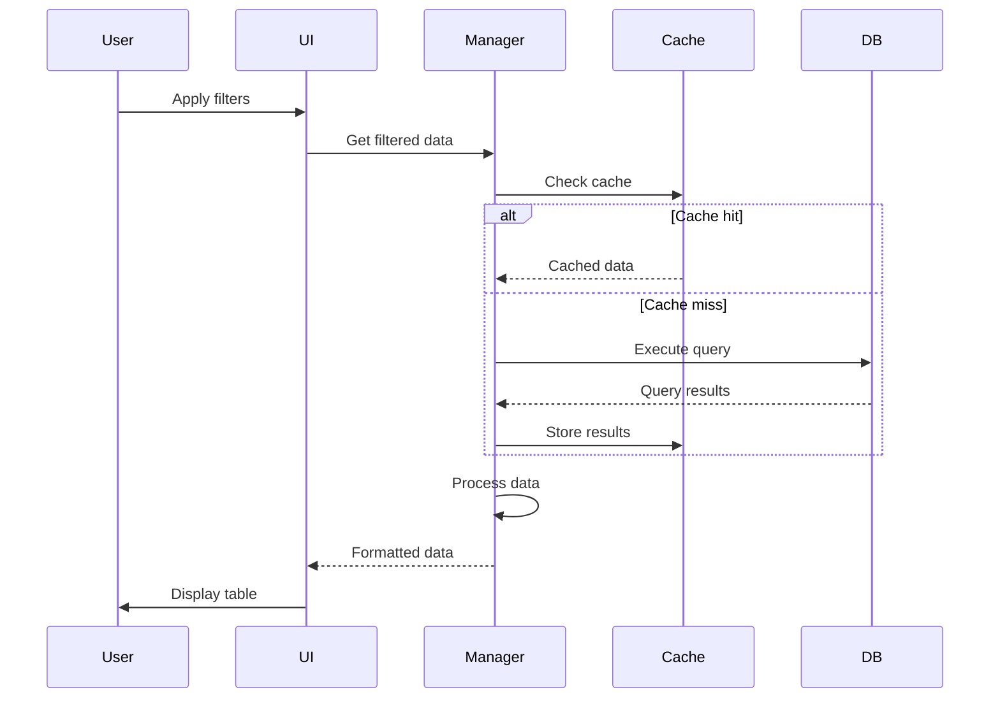

# Earnings Calendar Architecture

## Table of Contents

1. [System Overview](#system-overview)
2. [Architectural Principles](#architectural-principles)
3. [Component Architecture](#component-architecture)
4. [Data Architecture](#data-architecture)
5. [Integration Architecture](#integration-architecture)
6. [Security Architecture](#security-architecture)
7. [Performance Architecture](#performance-architecture)
8. [Deployment Architecture](#deployment-architecture)
9. [Technology Stack](#technology-stack)
10. [Design Patterns](#design-patterns)
11. [System Flows](#system-flows)
12. [Architecture Decisions](#architecture-decisions)

## System Overview

### High-Level Architecture

```
┌────────────────────────────────────────────────────────────┐
│                     User Interface Layer                    │
│                    (Streamlit Frontend)                     │
├────────────────────────────────────────────────────────────┤
│                    Presentation Layer                       │
│              (earnings_calendar_page.py)                    │
├────────────────────────────────────────────────────────────┤
│                     Business Logic Layer                    │
│                  (EarningsManager Class)                    │
├────────────────────────────────────────────────────────────┤
│                      Data Access Layer                      │
│                 (TradingViewDBManager)                      │
├────────────────────────────────────────────────────────────┤
│                    External Services Layer                  │
│                    (Robinhood API)                          │
├────────────────────────────────────────────────────────────┤
│                      Data Storage Layer                     │
│                   (PostgreSQL Database)                     │
└────────────────────────────────────────────────────────────┘
```

### Component Relationships



## Architectural Principles

### 1. Separation of Concerns

The architecture strictly separates:

- **Presentation Logic**: UI rendering and user interaction (`earnings_calendar_page.py`)
- **Business Logic**: Data processing and calculations (`EarningsManager`)
- **Data Access**: Database operations and connection management (`TradingViewDBManager`)
- **External Integration**: Third-party API interactions (Robinhood module)

### 2. Single Responsibility Principle

Each component has a clearly defined responsibility:

- **earnings_calendar_page.py**: UI rendering and event handling
- **EarningsManager**: Earnings data operations and business rules
- **TradingViewDBManager**: Database connection and query execution
- **Robinhood Integration**: API authentication and data fetching

### 3. Dependency Inversion

High-level modules depend on abstractions:

```python
# High-level module depends on abstraction
class EarningsManager:
    def __init__(self, db_config: Optional[Dict] = None):
        # Accepts configuration, not concrete implementation
        self.db_config = db_config
```

### 4. Open/Closed Principle

System is open for extension but closed for modification:

- New data sources can be added without modifying existing code
- Filter types can be extended through configuration
- Export formats can be added as plugins

### 5. Interface Segregation

Clients are not forced to depend on interfaces they don't use:

```python
# Separate interfaces for different concerns
class DataFetcher:
    def fetch_earnings(self, symbol: str) -> Dict

class DataProcessor:
    def calculate_surprise(self, row: pd.Series) -> float

class DataExporter:
    def export_csv(self, df: pd.DataFrame) -> str
```

## Component Architecture

### 1. User Interface Layer

#### earnings_calendar_page.py

**Responsibilities:**
- Render Streamlit components
- Handle user interactions
- Display data and metrics
- Manage UI state

**Key Functions:**

```python
def show_earnings_calendar():
    """Main entry point for earnings calendar UI"""
    # 1. Database initialization check
    # 2. Main interface rendering
    # 3. Event handling delegation

def sync_earnings_from_robinhood(conn, cur):
    """Handle earnings sync with progress tracking"""
    # 1. Authentication
    # 2. Progress visualization
    # 3. Error handling and recovery

def display_earnings_table(conn, cur):
    """Render filtered earnings data table"""
    # 1. Filter construction
    # 2. Query execution
    # 3. Data formatting and display
```

**State Management:**

```python
# Streamlit session state usage
if "earnings_synced" not in st.session_state:
    st.session_state.earnings_synced = False

# Filter state preservation
st.session_state.date_filter = date_filter
st.session_state.time_filter = time_filter
st.session_state.result_filter = result_filter
```

### 2. Business Logic Layer

#### EarningsManager Class

**Core Responsibilities:**
- Earnings data processing
- Business rule enforcement
- Calculation logic
- API orchestration

**Class Structure:**

```python
class EarningsManager:
    # Initialization
    def __init__(self, db_config: Optional[Dict] = None)
    def _ensure_tables(self)

    # Data Retrieval
    def get_earnings_events(self, **filters) -> pd.DataFrame
    def get_historical_earnings(self, symbol: str) -> pd.DataFrame

    # Calculations
    def _calculate_status(self, row) -> str
    def _calculate_surprise(self, row) -> float
    def _calculate_expected_move(self, row) -> float

    # Analytics
    def get_analytics(self, df: pd.DataFrame) -> Dict[str, Any]

    # Synchronization
    def sync_robinhood_earnings(self, symbols: List[str]) -> Dict
    def _insert_earnings_history(self, symbol: str, data: dict)

    # Resource Management
    def close(self)
```

**Business Rules:**

1. **Status Determination:**
   - Beat: eps_actual > eps_estimate
   - Miss: eps_actual < eps_estimate
   - Inline: eps_actual == eps_estimate
   - Pending: eps_actual is NULL

2. **Surprise Calculation:**
   ```python
   surprise = ((actual - estimate) / abs(estimate)) * 100
   ```

3. **Expected Move:**
   ```python
   expected_move = stock_price * implied_volatility
   ```

### 3. Data Access Layer

#### TradingViewDBManager

**Responsibilities:**
- Connection management
- Query execution
- Transaction handling
- Connection pooling

**Key Methods:**

```python
class TradingViewDBManager:
    def __init__(self):
        """Initialize with environment configuration"""

    def get_connection(self):
        """Return database connection"""

    def initialize_tables(self):
        """Create required database tables"""

    def execute_query(self, query: str, params: tuple):
        """Execute parameterized query"""
```

**Connection Management:**

```python
# Connection pooling pattern
@contextmanager
def get_db_connection():
    conn = psycopg2.connect(**db_config)
    try:
        yield conn
        conn.commit()
    except Exception:
        conn.rollback()
        raise
    finally:
        conn.close()
```

### 4. External Services Layer

#### Robinhood Integration

**Components:**
- Authentication module
- API client wrapper
- Rate limiting handler
- Response parser

**Integration Flow:**

```python
# 1. Authentication
rh.login(username, password)

# 2. Data fetching with retry logic
@retry(max_attempts=3, backoff_factor=2)
def fetch_earnings(symbol):
    return rh.get_earnings(symbol)

# 3. Cleanup
rh.logout()
```

## Data Architecture

### 1. Database Schema Design

#### Entity Relationship Diagram

```
┌──────────────────┐        ┌──────────────────┐
│ earnings_events  │        │    stocks        │
├──────────────────┤        ├──────────────────┤
│ id (PK)          │        │ id (PK)          │
│ symbol (FK)      │◄───────│ ticker           │
│ earnings_date    │        │ name             │
│ earnings_time    │        │ sector           │
│ eps_estimate     │        │ industry         │
│ eps_actual       │        │ market_cap       │
│ ...              │        │ ...              │
└──────────────────┘        └──────────────────┘
         │
         │
         ▼
┌──────────────────┐
│ earnings_history │
├──────────────────┤
│ id (PK)          │
│ symbol (FK)      │
│ report_date      │
│ quarter          │
│ year             │
│ eps_actual       │
│ ...              │
└──────────────────┘
```

### 2. Data Flow Architecture

```
External Data Source          Processing Pipeline           Storage
─────────────────            ─────────────────           ─────────
                                      │
Robinhood API ──────► Fetch ────► Validate ────► Transform
                        │             │              │
                        ▼             ▼              ▼
                    Rate Limit    Type Check    Normalize
                        │             │              │
                        └─────────────┴──────────────┘
                                      │
                                      ▼
                                   Upsert
                                      │
                                      ▼
                                 PostgreSQL
                                      │
                                      ▼
                                Redis Cache
```

### 3. Data Consistency Model

#### ACID Compliance

- **Atomicity**: All database operations wrapped in transactions
- **Consistency**: Unique constraints prevent duplicate entries
- **Isolation**: Read committed isolation level
- **Durability**: Write-ahead logging enabled

#### Conflict Resolution

```sql
INSERT INTO earnings_events (...)
VALUES (...)
ON CONFLICT (symbol, earnings_date)
DO UPDATE SET
    eps_actual = EXCLUDED.eps_actual,
    updated_at = NOW()
```

### 4. Caching Architecture

#### Redis Integration

```python
# Cache key pattern
cache_key = f"earnings:{symbol}:{date}"

# Cache operations
def get_cached_earnings(symbol, date):
    key = f"earnings:{symbol}:{date}"
    data = redis_client.get(key)
    if data:
        return json.loads(data)
    return None

def cache_earnings(symbol, date, data, ttl=3600):
    key = f"earnings:{symbol}:{date}"
    redis_client.setex(key, ttl, json.dumps(data))
```

## Integration Architecture

### 1. API Integration Pattern

#### Adapter Pattern Implementation

```python
class EarningsDataAdapter(ABC):
    @abstractmethod
    def fetch_earnings(self, symbol: str) -> List[Dict]:
        pass

class RobinhoodAdapter(EarningsDataAdapter):
    def fetch_earnings(self, symbol: str) -> List[Dict]:
        raw_data = rh.get_earnings(symbol)
        return self.transform(raw_data)

    def transform(self, raw_data):
        # Transform Robinhood format to internal format
        pass

class AlphaVantageAdapter(EarningsDataAdapter):
    def fetch_earnings(self, symbol: str) -> List[Dict]:
        # Alternative data source implementation
        pass
```

### 2. Event-Driven Architecture

#### Event Flow

```
User Action ──► UI Event ──► Business Event ──► Data Event ──► Storage Event
     │              │              │                │              │
     ▼              ▼              ▼                ▼              ▼
Click Sync    Trigger Sync   Process Batch    Fetch Data    Update Database
```

### 3. Service Communication

#### Internal Service Calls

```python
# Service registry pattern
class ServiceRegistry:
    services = {
        'earnings': EarningsManager,
        'database': TradingViewDBManager,
        'auth': RobinhoodAuth
    }

    @classmethod
    def get_service(cls, name):
        return cls.services[name]
```

## Security Architecture

### 1. Authentication Flow

```
User ──► Environment ──► Credentials ──► Robinhood ──► Token
             │               │              │            │
             ▼               ▼              ▼            ▼
         .env file      Validation      API Call    Session
```

### 2. Authorization Matrix

| Component | Read | Write | Execute | Admin |
|-----------|------|-------|---------|-------|
| User | ✓ | ✓ | ✓ | ✗ |
| EarningsManager | ✓ | ✓ | ✓ | ✗ |
| DBManager | ✓ | ✓ | ✗ | ✗ |
| Admin | ✓ | ✓ | ✓ | ✓ |

### 3. Data Protection

#### Encryption at Rest

```python
# Environment variable encryption
from cryptography.fernet import Fernet

def encrypt_credential(credential):
    key = os.getenv('ENCRYPTION_KEY')
    f = Fernet(key)
    return f.encrypt(credential.encode())
```

#### SQL Injection Prevention

```python
# Parameterized queries
cur.execute(
    "SELECT * FROM earnings WHERE symbol = %s",
    (symbol,)  # Parameters passed separately
)
```

## Performance Architecture

### 1. Query Optimization

#### Index Strategy

```sql
-- Primary indexes
CREATE INDEX idx_earnings_date ON earnings_events(earnings_date DESC);
CREATE INDEX idx_symbol ON earnings_events(symbol);

-- Composite indexes for common queries
CREATE INDEX idx_symbol_date ON earnings_events(symbol, earnings_date);

-- Partial indexes for filtered queries
CREATE INDEX idx_pending ON earnings_events(earnings_date)
WHERE eps_actual IS NULL;
```

### 2. Batch Processing

#### Chunk Processing Pattern

```python
def process_in_batches(symbols, batch_size=100):
    for i in range(0, len(symbols), batch_size):
        batch = symbols[i:i + batch_size]
        yield batch

# Usage
for batch in process_in_batches(all_symbols):
    sync_batch(batch)
```

### 3. Asynchronous Operations

#### Async/Await Pattern

```python
async def async_sync_earnings(symbols):
    tasks = []
    for symbol in symbols:
        task = asyncio.create_task(fetch_earnings_async(symbol))
        tasks.append(task)

    results = await asyncio.gather(*tasks)
    return results
```

### 4. Resource Pooling

#### Connection Pool Configuration

```python
# Database connection pool
from psycopg2 import pool

connection_pool = pool.SimpleConnectionPool(
    minconn=1,
    maxconn=20,
    **db_config
)
```

## Deployment Architecture

### 1. Container Architecture

#### Docker Configuration

```dockerfile
FROM python:3.12-slim

WORKDIR /app

# Install dependencies
COPY requirements.txt .
RUN pip install -r requirements.txt

# Copy application
COPY . .

# Environment variables
ENV DB_HOST=postgres
ENV DB_PORT=5432

# Run application
CMD ["streamlit", "run", "dashboard.py"]
```

### 2. Service Orchestration

#### Docker Compose

```yaml
version: '3.8'

services:
  app:
    build: .
    ports:
      - "8501:8501"
    environment:
      - DB_HOST=postgres
    depends_on:
      - postgres
      - redis

  postgres:
    image: postgres:15
    environment:
      - POSTGRES_DB=magnus
      - POSTGRES_USER=postgres
      - POSTGRES_PASSWORD=postgres123!
    volumes:
      - postgres_data:/var/lib/postgresql/data

  redis:
    image: redis:7
    ports:
      - "6379:6379"

volumes:
  postgres_data:
```

### 3. Scaling Architecture

#### Horizontal Scaling

```
                Load Balancer
                     │
        ┌────────────┼────────────┐
        ▼            ▼            ▼
    Instance 1   Instance 2   Instance 3
        │            │            │
        └────────────┼────────────┘
                     ▼
              Shared Database
                     │
                ┌────┴────┐
                ▼         ▼
            Primary   Read Replica
```

## Technology Stack

### Core Technologies

| Layer | Technology | Purpose |
|-------|------------|---------|
| Frontend | Streamlit 1.28+ | UI framework |
| Backend | Python 3.12 | Application logic |
| Database | PostgreSQL 15 | Data persistence |
| Cache | Redis 7 | Performance optimization |
| API Client | robin-stocks | Robinhood integration |
| ORM | psycopg2 | Database connectivity |
| Data Processing | pandas | Data manipulation |
| Environment | python-dotenv | Configuration management |

### Supporting Libraries

| Library | Version | Purpose |
|---------|---------|---------|
| pandas | 2.0+ | Data analysis |
| numpy | 1.24+ | Numerical operations |
| plotly | 5.0+ | Visualizations |
| asyncio | Built-in | Async operations |
| logging | Built-in | Application logging |
| datetime | Built-in | Date/time handling |

## Design Patterns

### 1. Repository Pattern

```python
class EarningsRepository:
    def __init__(self, db_manager):
        self.db = db_manager

    def find_by_symbol(self, symbol):
        return self.db.query("SELECT * FROM earnings WHERE symbol = %s", symbol)

    def save(self, earning):
        return self.db.execute("INSERT INTO earnings ...", earning)
```

### 2. Factory Pattern

```python
class DataSourceFactory:
    @staticmethod
    def create_source(source_type):
        if source_type == 'robinhood':
            return RobinhoodDataSource()
        elif source_type == 'alpha_vantage':
            return AlphaVantageDataSource()
        else:
            raise ValueError(f"Unknown source: {source_type}")
```

### 3. Observer Pattern

```python
class EarningsObserver:
    def __init__(self):
        self.observers = []

    def attach(self, observer):
        self.observers.append(observer)

    def notify(self, event):
        for observer in self.observers:
            observer.update(event)
```

### 4. Decorator Pattern

```python
def with_retry(max_attempts=3):
    def decorator(func):
        @functools.wraps(func)
        def wrapper(*args, **kwargs):
            for attempt in range(max_attempts):
                try:
                    return func(*args, **kwargs)
                except Exception as e:
                    if attempt == max_attempts - 1:
                        raise
                    time.sleep(2 ** attempt)
            return wrapper
    return decorator

@with_retry(max_attempts=3)
def fetch_earnings(symbol):
    return rh.get_earnings(symbol)
```

## System Flows

### 1. Initialization Flow



### 2. Synchronization Flow



### 3. Query Flow



## Architecture Decisions

### 1. Why Streamlit?

**Decision**: Use Streamlit for UI framework

**Rationale**:
- Rapid development with Python-only stack
- Built-in components for data visualization
- Automatic reactivity and state management
- No JavaScript/HTML/CSS required

**Alternatives Considered**:
- Flask + React: More complex, longer development time
- Django: Overkill for single-page application
- FastAPI + Vue: Requires frontend expertise

### 2. Why PostgreSQL?

**Decision**: Use PostgreSQL for data storage

**Rationale**:
- ACID compliance for financial data integrity
- Rich indexing capabilities for performance
- JSON support for flexible schema evolution
- Mature ecosystem and tooling

**Alternatives Considered**:
- MongoDB: Lacks ACID guarantees
- SQLite: Not suitable for concurrent access
- MySQL: Less feature-rich for analytics

### 3. Why Robinhood API?

**Decision**: Primary data source is Robinhood

**Rationale**:
- Free access to earnings data
- Real-time updates
- Integration with trading platform
- Comprehensive historical data

**Alternatives Considered**:
- Alpha Vantage: Rate limits too restrictive
- IEX Cloud: Requires paid subscription
- Yahoo Finance: Less reliable, unofficial API

### 4. Why Redis Cache?

**Decision**: Implement Redis for caching

**Rationale**:
- Sub-millisecond response times
- Automatic expiration policies
- Pub/sub for real-time updates
- Distributed caching support

**Alternatives Considered**:
- In-memory Python cache: Not persistent
- Memcached: Less feature-rich
- File-based cache: Poor performance

### 5. Why Synchronous Processing?

**Decision**: Use synchronous processing for sync

**Rationale**:
- Simpler error handling
- Predictable execution order
- Easier progress tracking
- Streamlit's execution model

**Trade-offs**:
- Slower than async processing
- UI blocks during sync
- Limited concurrent operations

### 6. Why Manual Sync Trigger?

**Decision**: User-initiated sync vs automatic

**Rationale**:
- User control over API usage
- Predictable system behavior
- Avoid rate limiting issues
- Transparent operation

**Future Enhancement**:
- Add scheduled sync option
- Implement incremental updates
- Background job processing

## Conclusion

The Earnings Calendar architecture balances simplicity with extensibility, providing a robust foundation for earnings data management. The layered architecture ensures clear separation of concerns, while the modular design allows for future enhancements without disrupting existing functionality.

Key architectural strengths:
- **Maintainability**: Clear component boundaries
- **Scalability**: Horizontal scaling capabilities
- **Reliability**: Comprehensive error handling
- **Performance**: Optimized queries and caching
- **Security**: Defense in depth approach

The architecture supports the feature's core mission of providing accessible, reliable earnings intelligence while maintaining the flexibility to evolve with changing requirements and data sources.