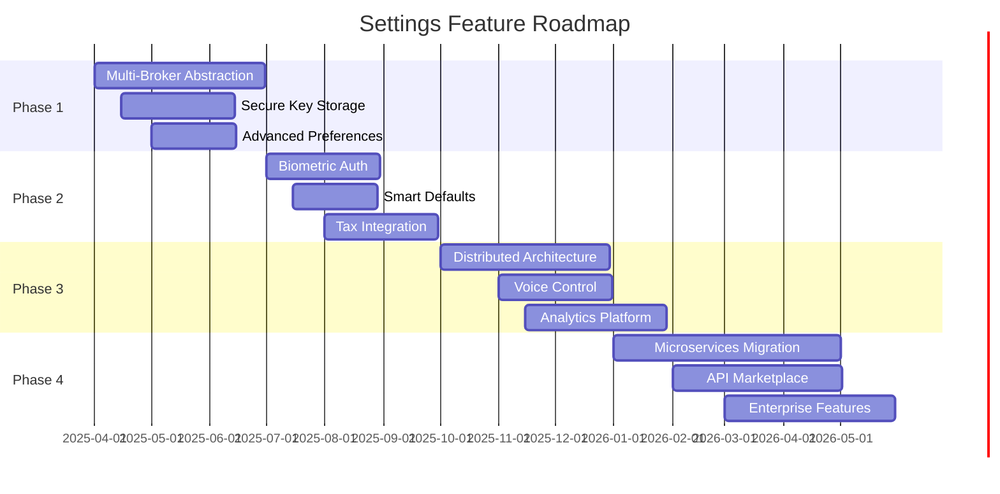

# Settings Feature - Wishlist & Roadmap

## Table of Contents

1. [Executive Vision](#executive-vision)
2. [Multi-Broker Support](#multi-broker-support)
3. [API Key Management](#api-key-management)
4. [Advanced Preferences](#advanced-preferences)
5. [Security Enhancements](#security-enhancements)
6. [User Experience Improvements](#user-experience-improvements)
7. [Infrastructure Upgrades](#infrastructure-upgrades)
8. [Integration Ecosystem](#integration-ecosystem)
9. [Analytics and Monitoring](#analytics-and-monitoring)
10. [Implementation Roadmap](#implementation-roadmap)

## Executive Vision

The Settings feature will evolve into a comprehensive configuration hub that manages all aspects of the trading platform's connectivity, security, and personalization. Our vision encompasses enterprise-grade security, seamless multi-broker integration, and intelligent preference management that adapts to user behavior.

### Strategic Goals

1. **Universal Broker Connectivity**: Support for all major brokers with unified interface
2. **Zero-Trust Security**: Military-grade encryption and authentication
3. **Intelligent Configuration**: AI-driven preference optimization
4. **Seamless Experience**: One-click setup with smart defaults
5. **Enterprise Ready**: Compliance with institutional requirements

## Multi-Broker Support

### Phase 1: Broker Abstraction Layer (Q2 2025)

#### Unified Broker Interface

```python
class BrokerInterface(ABC):
    """Abstract base class for all broker integrations"""

    @abstractmethod
    def connect(self, credentials: Credentials) -> Session:
        """Establish broker connection"""

    @abstractmethod
    def get_account(self) -> AccountSummary:
        """Retrieve account information"""

    @abstractmethod
    def get_positions(self) -> List[Position]:
        """Retrieve current positions"""

    @abstractmethod
    def place_order(self, order: Order) -> OrderResult:
        """Execute trade order"""

    @abstractmethod
    def get_market_data(self, symbol: str) -> MarketData:
        """Retrieve real-time market data"""
```

#### Broker Registry

```yaml
brokers:
  robinhood:
    status: implemented
    features: [stocks, options, crypto]
    markets: [US]
    api_type: REST
    auth: OAuth2

  etrade:
    status: planned_q2_2025
    features: [stocks, options, futures, forex]
    markets: [US, International]
    api_type: REST
    auth: OAuth1

  interactive_brokers:
    status: planned_q3_2025
    features: [stocks, options, futures, forex, bonds]
    markets: [Global]
    api_type: Gateway
    auth: Token

  td_ameritrade:
    status: planned_q3_2025
    features: [stocks, options, futures]
    markets: [US]
    api_type: REST
    auth: OAuth2

  alpaca:
    status: planned_q4_2025
    features: [stocks, crypto]
    markets: [US]
    api_type: REST
    auth: API_Key

  tradier:
    status: planned_q4_2025
    features: [stocks, options]
    markets: [US]
    api_type: REST
    auth: OAuth2

  schwab:
    status: research_2026
    features: [stocks, options, bonds, mutual_funds]
    markets: [US, International]
    api_type: REST
    auth: OAuth2
```

### Phase 2: Multi-Account Management (Q3 2025)

#### Account Aggregation

```python
class AccountManager:
    """Manage multiple broker accounts"""

    def __init__(self):
        self.accounts: Dict[str, BrokerAccount] = {}
        self.primary_account: Optional[str] = None

    def add_account(
        self,
        broker: BrokerType,
        credentials: Credentials,
        alias: str = None
    ) -> str:
        """Add new broker account"""
        account_id = self._generate_account_id(broker, alias)
        self.accounts[account_id] = BrokerAccount(broker, credentials)
        return account_id

    def aggregate_positions(self) -> AggregatedPositions:
        """Combine positions across all accounts"""
        positions = AggregatedPositions()
        for account in self.accounts.values():
            positions.add(account.get_positions())
        return positions

    def get_total_buying_power(self) -> float:
        """Calculate total buying power across accounts"""
        return sum(acc.get_buying_power() for acc in self.accounts.values())

    def execute_order_routing(self, order: Order) -> OrderResult:
        """Smart order routing across accounts"""
        # Route to best account based on:
        # - Available funds
        # - Commission structure
        # - Position consolidation
        # - Tax implications
        best_account = self._find_best_account(order)
        return best_account.place_order(order)
```

#### Portfolio Unification

```
┌──────────────────────────────────────────────┐
│            Unified Portfolio View             │
├───────────────┬─────────────┬────────────────┤
│  Robinhood    │   E*TRADE   │     IBKR       │
│  ┌─────────┐  │ ┌─────────┐ │  ┌─────────┐  │
│  │ AAPL x100│  │ │MSFT x200│ │  │TSLA x50 │  │
│  │ SPY CSP  │  │ │QQQ CC   │ │  │VIX Put  │  │
│  └─────────┘  │ └─────────┘ │  └─────────┘  │
└───────────────┴─────────────┴────────────────┘
                       │
                       ▼
            ┌──────────────────┐
            │ Aggregated View   │
            │ Total: $500,000   │
            │ Positions: 15     │
            │ P&L: +$12,500     │
            └──────────────────┘
```

### Phase 3: Broker Migration Tools (Q4 2025)

#### Position Transfer Assistant

```python
class BrokerMigration:
    """Assist with broker-to-broker migrations"""

    def analyze_transfer(
        self,
        from_broker: BrokerAccount,
        to_broker: BrokerAccount
    ) -> TransferAnalysis:
        """Analyze transfer implications"""
        return TransferAnalysis(
            transferable_positions=self._get_transferable(),
            estimated_time="5-7 business days",
            fees=self._calculate_transfer_fees(),
            tax_implications=self._analyze_tax_impact(),
            restrictions=self._check_restrictions()
        )

    def initiate_acats_transfer(
        self,
        from_account: str,
        to_account: str,
        positions: List[Position]
    ) -> TransferRequest:
        """Initiate ACATS transfer"""
        # Automated Customer Account Transfer Service
        pass

    def export_trade_history(
        self,
        account: BrokerAccount,
        format: str = "csv"
    ) -> bytes:
        """Export historical data for record keeping"""
        pass
```

## API Key Management

### Secure Key Storage System (Q2 2025)

#### Key Vault Implementation

```python
class APIKeyVault:
    """Secure storage for API credentials"""

    def __init__(self, backend: str = "system"):
        self.backend = self._initialize_backend(backend)
        # Backends: system_keyring, hashicorp_vault, aws_secrets, azure_keyvault

    def store_api_key(
        self,
        service: str,
        key_name: str,
        key_value: str,
        metadata: Dict = None
    ):
        """Store API key securely"""
        encrypted_key = self._encrypt(key_value)
        self.backend.store(
            service=service,
            key_name=key_name,
            value=encrypted_key,
            metadata=metadata or {}
        )

    def rotate_keys(self):
        """Automated key rotation"""
        for service in self.backend.list_services():
            if self._should_rotate(service):
                new_key = self._request_new_key(service)
                self._archive_old_key(service)
                self.store_api_key(service, "primary", new_key)
```

#### Market Data Provider Keys

```yaml
data_providers:
  polygon:
    tier: premium
    rate_limit: 1000/min
    features: [real_time, historical, options_chain]
    cost: $199/month

  alpha_vantage:
    tier: free
    rate_limit: 5/min
    features: [delayed_quotes, daily_data]
    cost: $0

  iex_cloud:
    tier: launch
    rate_limit: 100/sec
    features: [real_time, news, fundamentals]
    cost: $9/month

  finnhub:
    tier: professional
    rate_limit: 300/min
    features: [real_time, news, sentiment]
    cost: $49/month

  quandl:
    tier: premium
    features: [alternative_data, fundamentals]
    cost: custom

  yahoo_finance:
    tier: free
    rate_limit: unlimited
    features: [basic_quotes, historical]
    cost: $0
```

### API Key Lifecycle Management (Q3 2025)

```python
class APIKeyLifecycle:
    """Manage API key lifecycle"""

    def __init__(self):
        self.keys: Dict[str, APIKey] = {}
        self.rotation_policy = RotationPolicy()

    def provision_key(self, provider: str) -> APIKey:
        """Provision new API key"""
        key = APIKey(
            provider=provider,
            value=self._generate_secure_key(),
            created_at=datetime.now(),
            expires_at=datetime.now() + timedelta(days=90),
            status="active"
        )
        self.keys[key.id] = key
        return key

    def monitor_usage(self):
        """Monitor API key usage and limits"""
        for key in self.keys.values():
            usage = self._get_usage_stats(key)
            if usage.approaching_limit():
                self._handle_rate_limit(key)
            if usage.suspicious_activity():
                self._investigate_security(key)

    def handle_expiration(self):
        """Manage key expiration and renewal"""
        for key in self.keys.values():
            if key.expires_soon():
                self._renew_key(key)
            if key.expired():
                self._deactivate_key(key)
```

## Advanced Preferences

### User Preference System (Q2 2025)

#### Comprehensive Preference Schema

```python
@dataclass
class UserPreferences:
    """Complete user preference configuration"""

    # Trading Preferences
    trading: TradingPreferences = field(default_factory=lambda: TradingPreferences(
        default_order_type="limit",
        default_time_in_force="day",
        confirm_orders=True,
        max_position_size=0.05,  # 5% of portfolio
        max_loss_per_trade=0.02,  # 2% stop loss
        preferred_expiration_dte=30,
        min_premium_collected=50,
        preferred_delta=0.30,
        avoid_earnings=True,
        avoid_ex_dividend=True
    ))

    # Display Preferences
    display: DisplayPreferences = field(default_factory=lambda: DisplayPreferences(
        theme="auto",  # auto, light, dark, high_contrast
        density="comfortable",  # compact, comfortable, spacious
        number_format="currency",  # currency, percentage, decimal
        date_format="MM/DD/YYYY",
        time_zone="America/New_York",
        language="en-US",
        show_tooltips=True,
        animations_enabled=True,
        color_blind_mode=False
    ))

    # Notification Preferences
    notifications: NotificationPreferences = field(default_factory=lambda: NotificationPreferences(
        email_enabled=True,
        sms_enabled=False,
        push_enabled=True,
        discord_enabled=False,
        slack_enabled=False,
        triggers={
            "order_filled": ["email", "push"],
            "position_assigned": ["email", "sms", "push"],
            "large_move": ["push"],
            "expiration_approaching": ["email"],
            "margin_call": ["email", "sms", "push"]
        }
    ))

    # Risk Management
    risk: RiskPreferences = field(default_factory=lambda: RiskPreferences(
        max_portfolio_risk=0.10,  # 10% max drawdown
        position_sizing_method="kelly",  # fixed, kelly, equal_weight
        diversification_rules={
            "max_sector_allocation": 0.30,
            "min_positions": 5,
            "max_correlation": 0.70
        },
        hedging_enabled=True,
        hedge_ratio=0.20  # 20% portfolio hedge
    ))

    # Automation Preferences
    automation: AutomationPreferences = field(default_factory=lambda: AutomationPreferences(
        auto_roll_enabled=False,
        roll_conditions={
            "min_dte": 7,
            "min_profit": 0.50,  # 50% profit captured
            "max_loss": -1.00  # 100% loss threshold
        },
        auto_close_winners=True,
        profit_target=0.50,  # Close at 50% profit
        scanner_enabled=True,
        scanner_frequency="hourly"
    ))
```

### Preference Templates (Q3 2025)

```python
class PreferenceTemplates:
    """Pre-configured preference templates"""

    TEMPLATES = {
        "conservative": {
            "description": "Low risk, steady income focus",
            "trading.preferred_delta": 0.20,
            "trading.max_loss_per_trade": 0.01,
            "risk.max_portfolio_risk": 0.05,
            "automation.auto_close_winners": True,
            "automation.profit_target": 0.25
        },
        "moderate": {
            "description": "Balanced risk and reward",
            "trading.preferred_delta": 0.30,
            "trading.max_loss_per_trade": 0.02,
            "risk.max_portfolio_risk": 0.10,
            "automation.profit_target": 0.50
        },
        "aggressive": {
            "description": "Higher risk, higher reward",
            "trading.preferred_delta": 0.40,
            "trading.max_loss_per_trade": 0.05,
            "risk.max_portfolio_risk": 0.20,
            "automation.profit_target": 0.75
        },
        "wheel_focused": {
            "description": "Optimized for wheel strategy",
            "trading.preferred_delta": 0.30,
            "trading.preferred_expiration_dte": 45,
            "trading.avoid_earnings": True,
            "automation.auto_roll_enabled": True
        }
    }

    @classmethod
    def apply_template(cls, template_name: str) -> UserPreferences:
        """Apply preference template"""
        if template_name not in cls.TEMPLATES:
            raise ValueError(f"Unknown template: {template_name}")

        prefs = UserPreferences()
        template = cls.TEMPLATES[template_name]

        for key, value in template.items():
            if key == "description":
                continue
            # Navigate nested attributes
            parts = key.split('.')
            obj = prefs
            for part in parts[:-1]:
                obj = getattr(obj, part)
            setattr(obj, parts[-1], value)

        return prefs
```

### Intelligent Preference Learning (Q4 2025)

```python
class PreferenceLearning:
    """ML-based preference optimization"""

    def __init__(self):
        self.user_actions = []
        self.model = self._initialize_model()

    def track_action(self, action: UserAction):
        """Track user behavior"""
        self.user_actions.append({
            'timestamp': datetime.now(),
            'action_type': action.type,
            'parameters': action.parameters,
            'outcome': action.outcome
        })

    def suggest_optimizations(self) -> List[Suggestion]:
        """Suggest preference optimizations"""
        patterns = self._analyze_patterns()
        suggestions = []

        if patterns['frequent_profit_taking'] < 0.25:
            suggestions.append(Suggestion(
                "Lower profit target",
                "You often close positions early. Consider lowering profit target to 25%.",
                confidence=0.85
            ))

        if patterns['assignment_rate'] > 0.30:
            suggestions.append(Suggestion(
                "Adjust delta",
                "High assignment rate detected. Consider lower delta (0.20-0.25).",
                confidence=0.90
            ))

        return suggestions

    def auto_adjust(self, user_consent: bool = False):
        """Automatically adjust preferences based on behavior"""
        if not user_consent:
            return

        adjustments = self._calculate_adjustments()
        for adj in adjustments:
            if adj.confidence > 0.80:
                adj.apply()
```

## Security Enhancements

### Advanced Authentication (Q2 2025)

#### Biometric Authentication

```python
class BiometricAuth:
    """Biometric authentication support"""

    SUPPORTED_METHODS = [
        "face_recognition",
        "fingerprint",
        "voice_recognition",
        "behavioral_biometrics"
    ]

    def enroll_biometric(self, method: str, data: bytes):
        """Enroll biometric data"""
        if method not in self.SUPPORTED_METHODS:
            raise ValueError(f"Unsupported method: {method}")

        template = self._create_template(method, data)
        encrypted = self._encrypt_template(template)
        self._store_secure(encrypted)

    def authenticate(self, method: str, data: bytes) -> bool:
        """Verify biometric authentication"""
        stored_template = self._retrieve_template(method)
        current_template = self._create_template(method, data)
        return self._compare_templates(stored_template, current_template)
```

#### Hardware Security Keys

```python
class HardwareKeyAuth:
    """FIDO2/WebAuthn hardware key support"""

    def register_key(self, user_id: str) -> Registration:
        """Register hardware security key"""
        # Support for YubiKey, Titan, etc.
        challenge = self._generate_challenge()
        return Registration(
            user_id=user_id,
            challenge=challenge,
            rp_id="wheelstrategy.app"
        )

    def verify_assertion(self, assertion: bytes) -> bool:
        """Verify hardware key assertion"""
        # Cryptographic verification
        pass
```

### Zero-Knowledge Architecture (Q3 2025)

```python
class ZeroKnowledgeAuth:
    """Zero-knowledge proof authentication"""

    def create_proof(self, secret: str) -> Proof:
        """Create ZK proof without revealing secret"""
        # Implement zk-SNARK or zk-STARK
        commitment = self._commit(secret)
        challenge = self._get_challenge()
        response = self._respond(secret, challenge)
        return Proof(commitment, challenge, response)

    def verify_proof(self, proof: Proof) -> bool:
        """Verify ZK proof"""
        return self._verify(
            proof.commitment,
            proof.challenge,
            proof.response
        )
```

### Encryption Enhancements (Q4 2025)

#### End-to-End Encryption

```python
class E2EEncryption:
    """End-to-end encryption for all sensitive data"""

    def __init__(self):
        self.key_exchange = DiffieHellman()
        self.cipher_suite = ChaCha20Poly1305()

    def establish_channel(self, peer_public_key: bytes) -> SecureChannel:
        """Establish encrypted channel"""
        shared_secret = self.key_exchange.compute_shared_secret(peer_public_key)
        session_keys = self._derive_session_keys(shared_secret)
        return SecureChannel(session_keys, self.cipher_suite)

    def encrypt_message(self, channel: SecureChannel, plaintext: bytes) -> bytes:
        """Encrypt message for transmission"""
        nonce = os.urandom(12)
        ciphertext = channel.encrypt(plaintext, nonce)
        return nonce + ciphertext
```

#### Homomorphic Encryption

```python
class HomomorphicEncryption:
    """Perform calculations on encrypted data"""

    def encrypt_portfolio_value(self, value: float) -> EncryptedValue:
        """Encrypt portfolio value"""
        # Using Microsoft SEAL or IBM HELib
        pass

    def add_encrypted_values(self, a: EncryptedValue, b: EncryptedValue) -> EncryptedValue:
        """Add encrypted values without decryption"""
        pass

    def calculate_encrypted_pnl(self, positions: List[EncryptedPosition]) -> EncryptedValue:
        """Calculate P&L on encrypted positions"""
        pass
```

## User Experience Improvements

### Guided Setup Wizard (Q2 2025)

```python
class SetupWizard:
    """Interactive setup wizard for new users"""

    STEPS = [
        "welcome",
        "broker_selection",
        "account_connection",
        "risk_profile",
        "strategy_selection",
        "notification_setup",
        "initial_scan"
    ]

    def start_wizard(self) -> WizardSession:
        """Initialize setup wizard"""
        return WizardSession(
            steps=self.STEPS,
            current_step=0,
            data={}
        )

    def render_step(self, session: WizardSession):
        """Render current wizard step"""
        step = self.STEPS[session.current_step]

        if step == "welcome":
            return self._render_welcome()
        elif step == "broker_selection":
            return self._render_broker_selection()
        elif step == "risk_profile":
            return self._render_risk_questionnaire()
        # ... more steps

    def _render_risk_questionnaire(self):
        """Risk tolerance assessment"""
        questions = [
            "What is your investment experience?",
            "How would you react to a 20% portfolio decline?",
            "What is your primary investment goal?",
            "What is your investment time horizon?"
        ]
        return RiskAssessment(questions)
```

### Smart Defaults (Q3 2025)

```python
class SmartDefaults:
    """Intelligent default settings based on user profile"""

    def analyze_user_profile(self, user: User) -> UserProfile:
        """Analyze user characteristics"""
        return UserProfile(
            experience_level=self._assess_experience(user),
            risk_tolerance=self._assess_risk_tolerance(user),
            account_size=user.portfolio_value,
            trading_frequency=self._analyze_frequency(user),
            preferred_strategies=self._identify_strategies(user)
        )

    def generate_defaults(self, profile: UserProfile) -> Dict:
        """Generate personalized defaults"""
        defaults = {}

        if profile.experience_level == "beginner":
            defaults.update({
                "confirm_orders": True,
                "show_tooltips": True,
                "max_position_size": 0.02,
                "paper_trading": True
            })
        elif profile.experience_level == "intermediate":
            defaults.update({
                "confirm_orders": True,
                "show_tooltips": False,
                "max_position_size": 0.05,
                "paper_trading": False
            })
        else:  # advanced
            defaults.update({
                "confirm_orders": False,
                "show_tooltips": False,
                "max_position_size": 0.10,
                "advanced_features": True
            })

        return defaults
```

### Voice Control (Q4 2025)

```python
class VoiceControl:
    """Voice-activated trading commands"""

    COMMANDS = {
        "show positions": "display_positions",
        "check account": "show_account_summary",
        "scan for puts": "run_put_scanner",
        "close winner": "close_profitable_position",
        "what's my P&L": "show_pnl"
    }

    def __init__(self):
        self.recognizer = speech_recognition.Recognizer()
        self.tts = text_to_speech.Engine()

    def listen_for_command(self) -> Optional[str]:
        """Listen for voice command"""
        with microphone as source:
            audio = self.recognizer.listen(source)
            try:
                command = self.recognizer.recognize_google(audio)
                return self._parse_command(command)
            except:
                return None

    def execute_voice_command(self, command: str):
        """Execute recognized command"""
        if command in self.COMMANDS:
            action = self.COMMANDS[command]
            result = getattr(self, action)()
            self.tts.speak(f"Completed: {command}")
            return result
```

## Infrastructure Upgrades

### Distributed Architecture (Q3 2025)

```
┌────────────────────────────────────────────────────────┐
│                    Load Balancer                        │
└────────────────────────────────────────────────────────┘
                           │
        ┌──────────────────┴──────────────────┐
        │                                      │
┌───────▼────────┐                  ┌─────────▼────────┐
│   App Server 1 │                  │   App Server 2   │
│  (Primary)     │                  │   (Failover)     │
└────────────────┘                  └──────────────────┘
        │                                      │
        └──────────────────┬──────────────────┘
                           │
                ┌──────────▼──────────┐
                │   Message Queue     │
                │   (RabbitMQ/Kafka)  │
                └──────────────────────┘
                           │
     ┌─────────────────────┼─────────────────────┐
     │                     │                     │
┌────▼─────┐      ┌────────▼────────┐   ┌───────▼──────┐
│ Workers  │      │   Cache Layer   │   │  Database    │
│          │      │     (Redis)     │   │  (PostgreSQL)│
└──────────┘      └─────────────────┘   └──────────────┘
```

### Microservices Architecture (Q4 2025)

```yaml
services:
  auth_service:
    technology: FastAPI
    language: Python
    responsibilities:
      - Authentication
      - Authorization
      - Session management
    scaling: horizontal

  broker_gateway:
    technology: Node.js
    language: TypeScript
    responsibilities:
      - Broker connections
      - Order routing
      - Market data
    scaling: horizontal

  risk_engine:
    technology: Rust
    responsibilities:
      - Risk calculations
      - Position sizing
      - Portfolio analytics
    scaling: vertical

  notification_service:
    technology: Go
    responsibilities:
      - Email
      - SMS
      - Push notifications
    scaling: horizontal

  data_pipeline:
    technology: Apache Spark
    language: Scala
    responsibilities:
      - Data processing
      - Historical analysis
      - Backtesting
    scaling: elastic
```

### Container Orchestration (Q4 2025)

```yaml
# Kubernetes deployment configuration
apiVersion: apps/v1
kind: Deployment
metadata:
  name: wheel-strategy-settings
spec:
  replicas: 3
  selector:
    matchLabels:
      app: settings
  template:
    metadata:
      labels:
        app: settings
    spec:
      containers:
      - name: settings-api
        image: wheelstrategy/settings:latest
        ports:
        - containerPort: 8000
        env:
        - name: DATABASE_URL
          valueFrom:
            secretKeyRef:
              name: db-secret
              key: url
        resources:
          limits:
            memory: "512Mi"
            cpu: "500m"
          requests:
            memory: "256Mi"
            cpu: "250m"
        livenessProbe:
          httpGet:
            path: /health
            port: 8000
          initialDelaySeconds: 30
          periodSeconds: 10
```

## Integration Ecosystem

### Third-Party Integrations (Q2-Q4 2025)

#### Tax Software Integration

```python
class TaxIntegration:
    """Integration with tax preparation software"""

    SUPPORTED_PLATFORMS = [
        "TurboTax",
        "H&R Block",
        "FreeTaxUSA",
        "TaxAct",
        "Cash App Taxes"
    ]

    def export_tax_documents(self, year: int) -> TaxPackage:
        """Generate tax documents"""
        return TaxPackage(
            form_1099b=self._generate_1099b(year),
            form_8949=self._generate_8949(year),
            wash_sales=self._calculate_wash_sales(year),
            summary=self._create_summary(year)
        )

    def direct_import(self, platform: str) -> ImportResult:
        """Direct import to tax software"""
        if platform not in self.SUPPORTED_PLATFORMS:
            raise ValueError(f"Unsupported platform: {platform}")

        # OAuth flow for direct integration
        return self._platform_import(platform)
```

#### Portfolio Analytics Tools

```python
class AnalyticsIntegration:
    """Integration with portfolio analytics platforms"""

    def export_to_portfolio_visualizer(self) -> str:
        """Export for Portfolio Visualizer"""
        # CSV format for portfolio analysis
        pass

    def sync_with_personal_capital(self, credentials: Dict):
        """Sync with Personal Capital"""
        # API integration for net worth tracking
        pass

    def connect_morningstar_direct(self, api_key: str):
        """Connect to Morningstar Direct"""
        # Professional-grade analytics
        pass
```

#### Communication Platforms

```yaml
communication_integrations:
  discord:
    features:
      - Trade notifications
      - Position alerts
      - Daily summaries
    webhook_url: configured_by_user

  slack:
    features:
      - Team collaboration
      - Trade approvals
      - Risk alerts
    oauth_integration: true

  telegram:
    features:
      - Mobile notifications
      - Quick commands
      - Portfolio snapshots
    bot_token: required

  microsoft_teams:
    features:
      - Enterprise integration
      - Compliance reporting
      - Audit trails
    azure_ad_integration: true
```

### API Marketplace (Q4 2025)

```python
class APIMarketplace:
    """Third-party API marketplace"""

    def list_available_apis(self) -> List[APIListing]:
        """List available third-party APIs"""
        return [
            APIListing(
                name="Options Flow API",
                provider="FlowAlgo",
                description="Real-time options flow data",
                pricing="$99/month",
                data_types=["unusual_activity", "dark_pool", "sweeps"]
            ),
            APIListing(
                name="Sentiment Analysis",
                provider="StockTwits",
                description="Social sentiment data",
                pricing="Free",
                data_types=["bullish_bearish", "volume", "trending"]
            ),
            APIListing(
                name="Economic Calendar",
                provider="ForexFactory",
                description="Economic events and impact",
                pricing="Free",
                data_types=["events", "forecasts", "actuals"]
            )
        ]

    def subscribe_to_api(self, api_name: str, tier: str) -> Subscription:
        """Subscribe to third-party API"""
        # Handle subscription and billing
        pass

    def manage_api_usage(self) -> UsageReport:
        """Monitor and manage API usage"""
        # Track usage across all subscribed APIs
        pass
```

## Analytics and Monitoring

### Performance Analytics (Q3 2025)

```python
class PerformanceAnalytics:
    """Comprehensive performance tracking"""

    def calculate_metrics(self, period: str) -> PerformanceMetrics:
        """Calculate performance metrics"""
        return PerformanceMetrics(
            total_return=self._calculate_return(period),
            sharpe_ratio=self._calculate_sharpe(),
            sortino_ratio=self._calculate_sortino(),
            max_drawdown=self._calculate_max_drawdown(),
            win_rate=self._calculate_win_rate(),
            profit_factor=self._calculate_profit_factor(),
            average_days_in_trade=self._calculate_avg_days(),
            return_on_capital=self._calculate_roc()
        )

    def attribution_analysis(self) -> Attribution:
        """Performance attribution analysis"""
        return Attribution(
            by_strategy=self._attribute_by_strategy(),
            by_sector=self._attribute_by_sector(),
            by_timeframe=self._attribute_by_time(),
            by_market_condition=self._attribute_by_market()
        )

    def risk_adjusted_metrics(self) -> RiskMetrics:
        """Risk-adjusted performance metrics"""
        return RiskMetrics(
            var_95=self._calculate_var(0.95),
            cvar_95=self._calculate_cvar(0.95),
            beta=self._calculate_beta(),
            correlation_matrix=self._calculate_correlations()
        )
```

### Real-Time Monitoring (Q4 2025)

```python
class RealTimeMonitor:
    """Real-time system monitoring"""

    def __init__(self):
        self.metrics_collector = MetricsCollector()
        self.alert_manager = AlertManager()
        self.dashboard = MonitoringDashboard()

    def start_monitoring(self):
        """Start real-time monitoring"""
        # Collect metrics every second
        self.metrics_collector.start()

        # Update dashboard
        self.dashboard.stream_metrics(self.metrics_collector.stream)

        # Process alerts
        self.alert_manager.watch(self.metrics_collector.stream)

    def define_alerts(self):
        """Define monitoring alerts"""
        self.alert_manager.add_alert(
            name="High API Latency",
            condition=lambda m: m.api_latency > 1000,  # ms
            severity="WARNING"
        )
        self.alert_manager.add_alert(
            name="Authentication Failures",
            condition=lambda m: m.auth_failures > 5,
            severity="CRITICAL"
        )
        self.alert_manager.add_alert(
            name="Rate Limit Approaching",
            condition=lambda m: m.rate_limit_remaining < 10,
            severity="INFO"
        )
```

## Implementation Roadmap

### Timeline Overview



### Phase 1: Foundation (Q2 2025)

**Goals:**
- Abstract broker interface
- Implement secure key storage
- Deploy preference system

**Deliverables:**
1. Broker abstraction layer
2. API key vault
3. User preference framework
4. Migration tools

**Success Metrics:**
- Support for 2+ brokers
- Zero credential exposure incidents
- 90% user preference adoption

### Phase 2: Security & UX (Q3 2025)

**Goals:**
- Enhanced authentication
- Improved user experience
- Third-party integrations

**Deliverables:**
1. Biometric authentication
2. Hardware key support
3. Setup wizard
4. Tax software integration

**Success Metrics:**
- 50% users enable 2FA
- Setup time < 5 minutes
- Tax export accuracy 99.9%

### Phase 3: Scale & Intelligence (Q4 2025)

**Goals:**
- Distributed architecture
- Intelligent features
- Advanced analytics

**Deliverables:**
1. Kubernetes deployment
2. Voice control
3. ML-based preferences
4. Performance analytics

**Success Metrics:**
- 99.9% uptime
- Voice command accuracy > 95%
- Analytics adoption > 70%

### Phase 4: Enterprise & Ecosystem (Q1 2026)

**Goals:**
- Enterprise features
- API marketplace
- Complete ecosystem

**Deliverables:**
1. Microservices architecture
2. API marketplace launch
3. Enterprise security
4. Compliance tools

**Success Metrics:**
- 10+ API integrations
- Enterprise customer acquisition
- SOC 2 compliance

### Resource Requirements

```yaml
team_requirements:
  backend_developers: 3
  frontend_developers: 2
  security_engineer: 1
  devops_engineer: 1
  qa_engineer: 1
  product_manager: 1
  ui_ux_designer: 1

infrastructure:
  development:
    servers: 4
    cost: $500/month
  staging:
    servers: 6
    cost: $1000/month
  production:
    servers: 12
    cost: $3000/month

tools_and_services:
  monitoring: DataDog ($500/month)
  security: Snyk ($300/month)
  ci_cd: GitHub Actions ($200/month)
  cloud: AWS ($2000/month)

total_monthly_cost: $7500
total_team_size: 10
estimated_duration: 12 months
```

### Risk Assessment

| Risk | Probability | Impact | Mitigation |
|------|------------|--------|------------|
| Broker API changes | High | High | Maintain adapter pattern, version APIs |
| Security breach | Low | Critical | Multiple security layers, audits |
| Regulatory changes | Medium | High | Legal consultation, compliance buffer |
| User adoption | Medium | Medium | Gradual rollout, user feedback |
| Technical debt | High | Medium | Regular refactoring, code reviews |
| Scaling issues | Low | High | Load testing, auto-scaling |

### Success Criteria

1. **Technical Success**
   - 99.9% uptime
   - < 100ms average response time
   - Zero security breaches
   - 80% code coverage

2. **User Success**
   - 90% user satisfaction
   - < 5 minute setup time
   - 50% feature adoption
   - < 1% error rate

3. **Business Success**
   - 3x user growth
   - 5+ broker integrations
   - 20+ third-party APIs
   - Enterprise tier launch

## Conclusion

This wishlist represents a comprehensive vision for evolving the Settings feature into a world-class configuration and security hub. The phased approach ensures continuous delivery of value while building toward an ambitious long-term vision. Each enhancement is designed to improve security, usability, and extensibility while maintaining backward compatibility.

The roadmap balances immediate user needs with forward-looking infrastructure investments, ensuring the platform can scale from individual traders to enterprise deployments. With successful execution, the Settings feature will become a competitive differentiator and key driver of platform adoption.

---

*Wishlist Version: 1.0*
*Created: January 2025*
*Next Review: April 2025*