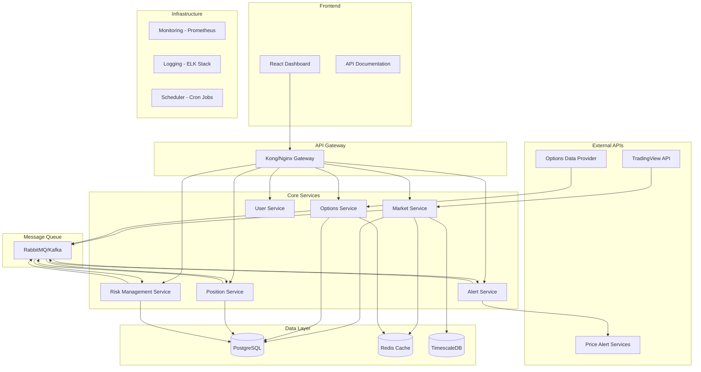

# Options Wheel Strategy Trading System Architecture

## System Overview

A microservices-based architecture for automated options wheel strategy trading with real-time data processing, risk management, and monitoring capabilities.

## High-Level Architecture



## Service Definitions

### 1. Market Service
**Responsibility**: Stock data ingestion, price tracking, watchlist management
- Pull data from TradingView watchlist
- Real-time price updates
- Historical data storage
- Stock filtering (under $50)

### 2. Options Service
**Responsibility**: Options data management, premium calculations, strategy analysis
- Fetch options chains
- Calculate implied volatility
- Rank premiums for CSP/CC strategies
- Greeks calculations

### 3. Position Service
**Responsibility**: Trade execution, position tracking, P&L calculations
- Manage open positions
- Track wheel strategy progression
- Calculate unrealized/realized P&L
- Position sizing logic

### 4. Alert Service
**Responsibility**: Notification system for price movements and strategy signals
- Price movement alerts
- Strategy execution signals
- Risk threshold breaches
- Email/SMS/Webhook notifications

### 5. Risk Management Service
**Responsibility**: Portfolio risk assessment, position sizing, exposure limits
- Portfolio-level risk metrics
- Position sizing calculations
- Exposure limit enforcement
- Correlation analysis

### 6. User Service
**Responsibility**: Authentication, authorization, user preferences
- JWT-based authentication
- Role-based access control
- User preference management
- API key management

## Technology Stack Recommendations

### Backend Services
- **Language**: Python (FastAPI) or Node.js (Express/NestJS)
- **API Framework**: FastAPI for Python, NestJS for Node.js
- **Authentication**: JWT with refresh tokens
- **Validation**: Pydantic (Python) or Joi/class-validator (Node.js)

### Databases
- **Primary DB**: PostgreSQL 14+ (ACID compliance, JSON support)
- **Time Series**: TimescaleDB extension for PostgreSQL
- **Caching**: Redis 6+ (data caching, session storage)
- **Search**: Elasticsearch (optional, for complex queries)

### Message Queue
- **Small Scale**: RabbitMQ
- **Large Scale**: Apache Kafka
- **Alternative**: Redis Pub/Sub for simpler use cases

### Infrastructure
- **Containerization**: Docker + Docker Compose
- **Orchestration**: Kubernetes (production) or Docker Swarm (simpler)
- **API Gateway**: Kong or Nginx
- **Monitoring**: Prometheus + Grafana
- **Logging**: ELK Stack (Elasticsearch, Logstash, Kibana)

### Frontend
- **Framework**: React with TypeScript
- **State Management**: Redux Toolkit or Zustand
- **UI Library**: Material-UI or Ant Design
- **Charts**: Chart.js or D3.js for financial charts
- **Real-time**: Socket.io or WebSockets

## Agent-Based Architecture Patterns

### 1. Market Data Agent
```python
class MarketDataAgent:
    def __init__(self):
        self.watchlist = []
        self.price_thresholds = {}

    async def fetch_watchlist_data(self):
        # Pull from TradingView API
        pass

    async def monitor_price_changes(self):
        # Continuous price monitoring
        pass

    async def filter_stocks_under_50(self):
        # Filter and update eligible stocks
        pass
```

### 2. Options Strategy Agent
```python
class WheelStrategyAgent:
    def __init__(self):
        self.strategy_rules = {}
        self.risk_parameters = {}

    async def scan_csp_opportunities(self):
        # Scan for cash-secured put opportunities
        pass

    async def scan_cc_opportunities(self):
        # Scan for covered call opportunities
        pass

    async def calculate_position_sizing(self):
        # Calculate optimal position sizes
        pass
```

### 3. Risk Management Agent
```python
class RiskManagementAgent:
    def __init__(self):
        self.portfolio_limits = {}
        self.correlation_matrix = {}

    async def assess_portfolio_risk(self):
        # Calculate portfolio-level risk metrics
        pass

    async def check_exposure_limits(self):
        # Ensure exposure within limits
        pass
```

### 4. Alert Agent
```python
class AlertAgent:
    def __init__(self):
        self.alert_rules = {}
        self.notification_channels = []

    async def monitor_price_movements(self):
        # Monitor for significant price movements
        pass

    async def send_notifications(self):
        # Send alerts via multiple channels
        pass
```

## Scalability Considerations

### Horizontal Scaling
1. **Stateless Services**: All services designed to be stateless
2. **Load Balancing**: Use reverse proxy for request distribution
3. **Database Sharding**: Partition data by symbol or date ranges
4. **Caching Strategy**: Multi-layer caching (Redis, CDN, application-level)

### Performance Optimization
1. **Database Indexing**: Proper indexes on frequently queried columns
2. **Connection Pooling**: Efficient database connection management
3. **Async Processing**: Use async/await for I/O operations
4. **Batch Processing**: Group operations for efficiency

### Monitoring & Observability
1. **Health Checks**: Implement health endpoints for all services
2. **Metrics Collection**: Custom business metrics + infrastructure metrics
3. **Distributed Tracing**: Track requests across services
4. **Error Tracking**: Centralized error logging and alerting

## Data Flow Examples

### 1. Stock Data Ingestion
```
TradingView API → Market Service → PostgreSQL/TimescaleDB → Redis Cache → WebSocket → Dashboard
```

### 2. Options Premium Calculation
```
Options Data Provider → Options Service → Calculate Premiums → Rank by Yield → Store Results → Alert Service
```

### 3. Wheel Strategy Execution
```
Market Signal → Strategy Agent → Risk Check → Position Service → Trade Execution → Position Tracking
```

This architecture provides a solid foundation for building a robust, scalable options wheel strategy trading system with clear separation of concerns and modern architectural patterns.